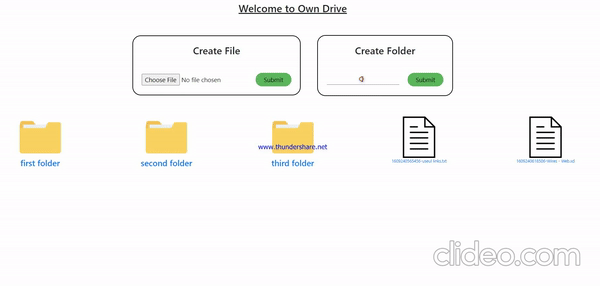
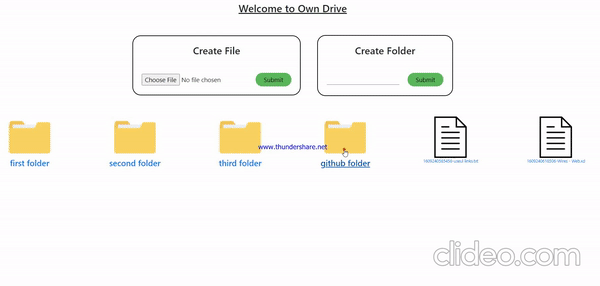

# Drive-MERN-Web

-> Create folders.

-> Create sub-folders within folders with no limit.

-> Upload files.

-> Upload files within any folder of your choice.

Your own Gogle drive implemented using MongoDB, NodeJs, ReactJs and Express.

Just make a .env file and paste your mongodb database url in MONGOURL and enjoy your personalized drive.
